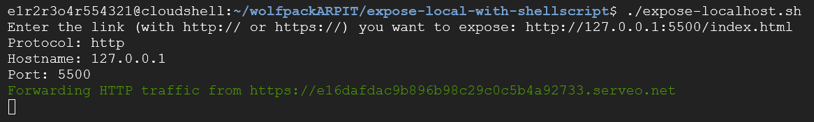

# Expose Local or Remote Server

This repository contains a simple shell script that will expose your localhost server to the INTERNET. Additionally, it includes a script to start a shell server for serving the files locally.

# OUTPUT:



# Expose Local or Remote Server by tunneling

This Bash script allows you to expose a local or remote web server to the internet. The script prompts you to input a URL,PORT and then sets up a tunnel to make the server accessible publicly.

## Prerequisites

- Bash>>: Ensure you have a Bash shell available.
- SSH>>: The script uses SSH to connect.
- Install>>:sudo apt install openssh-server


## Features

- Automatically detects `http://` or `https://` links.
- Exposes services on default ports (8080 for HTTP and 8443 for HTTPS).
- Option to provide a custom port number.
- Supports both localhost and remote server services.
- SSH-based tunneling to Serveo.

## How to Use

1. Clone the repository:
    ```sh
    git clone https://github.com/GET-UNKNOWN-ERR0R/expose-local-with-shellscript.git
  
    ```
    ```sh
    cd expose-local-with-shellscript
    ```

2. Make the script executable:
    ```sh
    chmod +x expose-localhost.sh
    ```

3. Run the script:
    ```sh
    ./expose-localhost.sh
    ```
    
## Notes

- **Security Consideration**: Exposing a server to the internet can be a security risk. Ensure your server is secure and only expose it when necessary.
- **Availability**: The script relies on tunneling , which may be unavailable at times. Consider alternatives like other tunneling platform,if it does not meet your needs.
,
